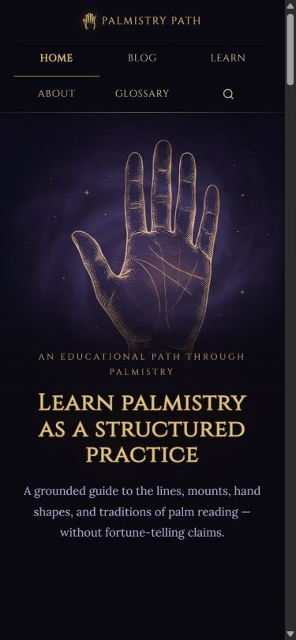
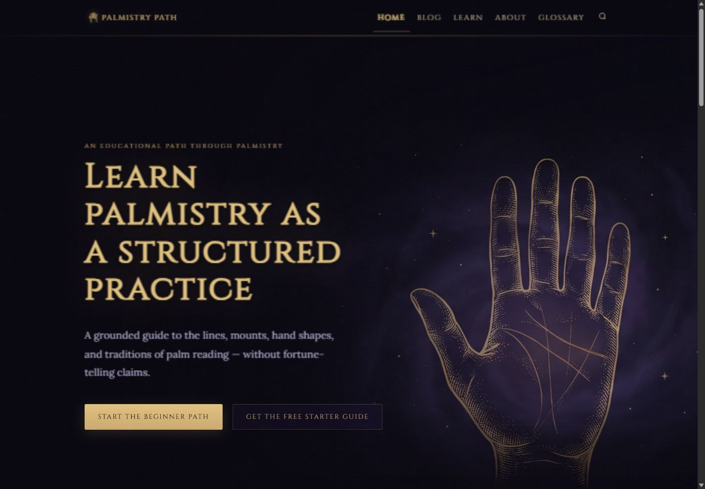
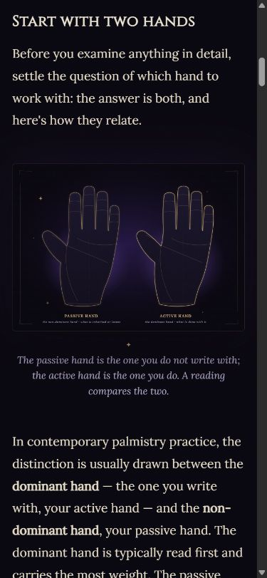
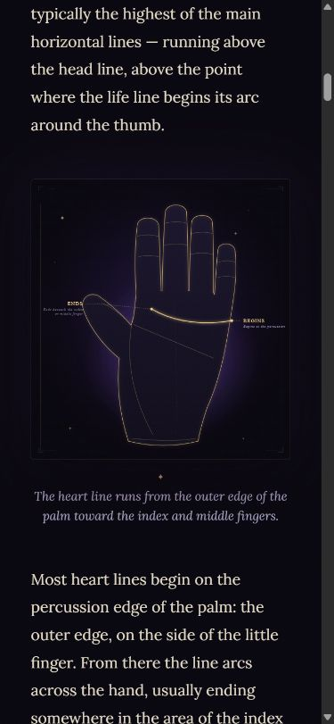
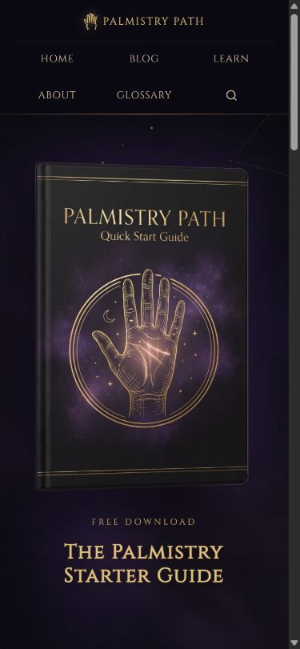
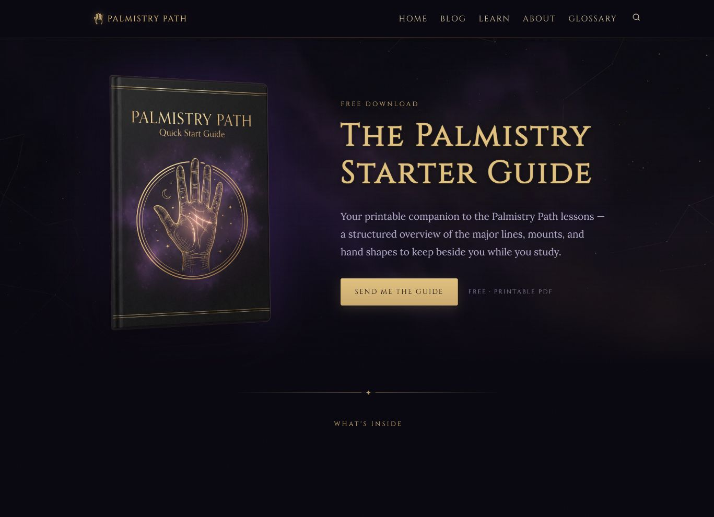

# Issue #122 — visual reconciliation review

Status: **REVIEW_READY** — implementation and QA complete; awaiting Chairman visual approval.

Review: [PR #123](https://github.com/palmistrypath-org/palmistry-site/pull/123). Implementation commit: `9f9911f5634470228512fa126c1d838122be30d1`. [Implementation CI run](https://github.com/palmistrypath-org/palmistry-site/actions/runs/34300470374) passed all build/audit/self-test checks. The PR is the current review head, including documentation closeout.

Review build: local production preview at `http://127.0.0.1:4321/`, plus the downloadable `palmistry-review-build.zip` in this Codex task's outputs. No automatic hosted-preview deployment was reported by GitHub's checks/deployments for the implementation SHA. Hosting configuration was not changed.

Governing brief: [Astra Macro Build Brief — Palmistry Visual Reconciliation](https://app.notion.com/p/3d59ad1d18c38163ba17d42056e7aaee).

Receiver/run: Codex Astra desktop task `01a082ee-286c-7900-b3ce-97d52622715e`, 2026-09-08. Execution evidence is the implementation commit, this inventory/QA package, and the PR. No ongoing worker or lease is implied after the review handoff.

## Baseline and reconciliation

- Protected main: `706b098c750d7ac85520dcd59675b540cb36f63a`.
- Working branch: `astra/visual-golden-slice-reconciliation`.
- Fable evidence: `feat/visual-golden-slice` at `de76f9bf74b33ab199afe552757b680b8e72189b`.
- Merge base: `2c0c3fa7a12e3fdd7fc9c2cbf0ec57408b830e21`; Fable was 3 ahead / 108 behind.
- Production browser baseline inspected at `https://palmistrypath.com/`: prior homepage, small old mark, cropped background hand. No production mutation was performed.

All **195 Fable source-delta files** are classified in the [file inventory](inventory.md). Only visual paths were forward-ported, using the source delta against its merge base; the Fable branch was not merged wholesale. The newer minor-lines article links were retained during the three-way application.

**Forward-ported:** dark black/gold/violet tokens, six-act homepage, portrait whole-hand mobile hero, generated hand mark, shared page openings, reveal pacing, framed figures, practice/checkpoint panels, lesson/article/navigation/footer/guide treatments, 46 atlas plates and 8 mount plates with their generators, and additive illustration placement in existing content.

**Already present and retained:** Cinzel/Lora, strongest wireframe/ornate imagery, learning sequence, accessible skip/focus controls, search, existing form/tracking behavior, indexability and canonical rules.

**Preserved:** 73 blog posts / 25 lessons; no article/lesson lines deleted. Newer Intuition Line and Rascettes articles remain unchanged. Products, package/lockfile, operational instructions, workflows, `.ai-ops`, indexing policy, and Relay gate/publisher have no Git delta against protected main. PR #120 products were neither overwritten nor regenerated. Guide form action, script, download fallback and tracking remain unchanged.

**Excluded/superseded:** stale Fable ACTIVE_TASK/CURRENT_STATE/changelog/decision/roadmap status was not imported. Current task documentation was authored independently. PR #120 supersedes Fable's old future-product plans. The website's promotional guide artwork is retained; replacing legacy free-guide delivery and commerce wiring remains issue #121 after visual approval.

## QA evidence

Local review build: `npm run preview -- --host 127.0.0.1 --port 4321` after `npm ci` and `npm run build`.

| Check | Result |
|---|---|
| Production build | PASS — 118 pages |
| Content audit | PASS — 73 blog posts, 25 lessons |
| Internal links/assets/orphans | PASS |
| Image paths, alt requirements and homepage raster budget | PASS |
| JSON-LD | PASS — 73 Article/Breadcrumb and 25 LearningResource/Breadcrumb pairs |
| Indexability/trust audit | PASS |
| Accessibility audit | PASS |
| Relay merge-gate self-test | PASS — 13 fixtures plus workflow trust-boundary check |
| Browser responsive matrix | PASS — 15 routes × 390/1440 px; exact rendered width checked; no horizontal overflow, missing main, duplicate h1 or loaded-image failures |
| Search | PASS — “heart line” returns results; selected result opens its illustrated article |
| Primary navigation | PASS — beginner-path CTA reaches first lesson |
| Keyboard | PASS — skip link moves focus to main with a visible outline; focus-within makes reveal containers visible |
| Guide surface | PASS — mobile/desktop artwork, signup anchor, required email field, existing PDF fallback; no live subscription was created |
| Console inspection | No application warning/error observed in reviewed tabs |

The [browser matrix](browser-qa.json) records the routes and measured widths. Browser captures below are from the local production build, not the production site. Reduced-motion and failed/no-JavaScript fallback were reviewed in source; browser emulation of those modes was not available. This is accessibility-basics verification, not a full assistive-technology certification.

### Visible review surfaces

| Mobile homepage — whole hand | Desktop homepage |
|---|---|
|  |  |

| Mobile lesson plate | Mobile article plate |
|---|---|
|  |  |

| Mobile guide | Desktop guide |
|---|---|
|  |  |

## Self-repairs

1. Moved the `html.js` reveal gate from an inline head script into the successfully loaded reveal controller so a failed module leaves content visible.
2. Added immediate focus-within visibility for keyboard navigation into reveal containers.
3. Bounded the lesson-footer haze and module-opening glow to their container width; repaired blog-list border-box sizing. Initial mobile overflow of 461/526px on a 390px viewport is gone.
4. Normalized generated SVG trailing whitespace in the shared writer, then regenerated only the site atlas/mark.
5. The existing Relay test assumes LF workflow text. Local CRLF checkout caused a false failure; restored LF in that local file and reran successfully. There is no committed workflow or Relay logic change.
6. The first browser handle intermittently retained an older viewport. Repeated the entire matrix in fresh tabs and required measured width to match the requested width before accepting results.

## Limits and reserved gate

- Dependency installation reports five existing audit advisories (1 low, 2 moderate, 2 high); dependencies/lockfile are unchanged from protected main. No broad dependency upgrade was introduced.
- Astro emits an existing API deprecation warning for the source branch's Markdown plugin registration; the configured integration builds and audits successfully.
- No live email, payment, fulfillment or production publication was exercised. Those flows were preserved and are outside issue #122's visual scope.
- Chairman visual approval is required before merge/publication. Issue #121 remains held pending that approval.
